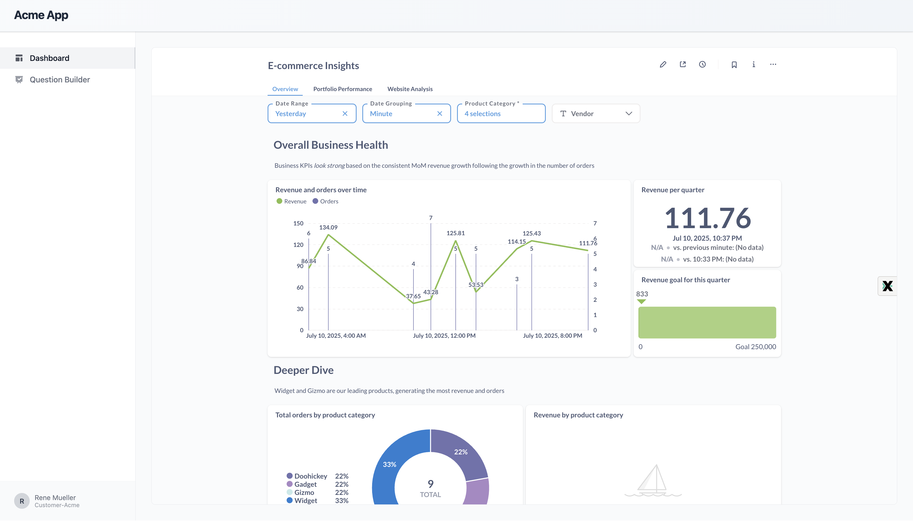
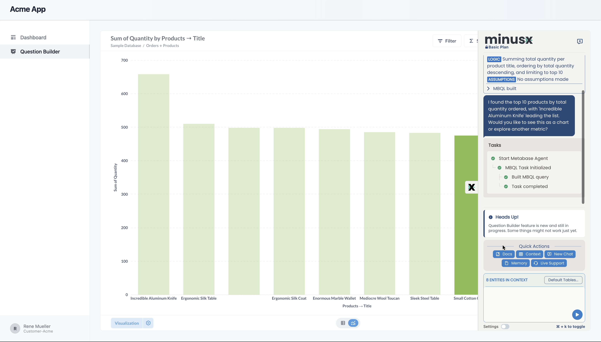

## Embedded Metabase + MinusX Example

This repo demonstrates how to add MinusX support to an application that embeds Metabase dashboards and questions. The proxy server handles injecting the MinusX js and custom css into the Metabase iFrame. With that, MinusX just works exactly like it does in the browser extension.




## Components / Architecture

- **server.js** (port 9090): Main application (this would be your application) server handling authentication and UI
- **proxy.js** (port 9091): Proxy server for Metabase instance and asset serving
- **Authentication**: Automatic SSO authentication using JWT tokens
- **Custom Assets**: Local CSS and other assets served through proxy


### Install dependencies

Run:

```sh
npm install
```

## Environment Configuration

Create a `.env` file in the root directory with the following variables:

```env
# Metabase Configuration
METABASE_JWT_SHARED_SECRET=your_jwt_shared_secret_here

# A dashboard path which you wish to embed. Example: /dashboard/1-e-commerce-insights
METABASE_DASHBOARD_PATH=your_dashboard_path

# An editor path which you wish to embed. Can be sql or mbql Example: /question/139-demo-mbql/notebook
METABASE_EDITOR_PATH=your_editor_path #Example: /question/139-demo-mbql/notebook

# Proxy Configuration
TARGET=https://your-metabase-instance.com
EXTENSION_TARGET=https://web.minusxapi.com/extension-build
```

## Custom CSS

You can customize the appearance by modifying the `custom.css` file. This file is served when `/minusx.css` is requested, allowing you to:

- Override default styles
- Define custom CSS variables (like the minusxGreen color palette)
- Apply custom branding and theming

The current `custom.css` includes CSS variables for a custom color palette:

```css
:root {
  --chakra-colors-minusxGreen-50: #ebf8ff;
  --chakra-colors-minusxGreen-100: #bee3f8;
  /* ... more color variables ... */
}
```

## Starting the app

Start the server by running:

```sh
npm run server
```

Start the proxy server

```sh
npm run proxy
```

## Development Mode

Start the proxy server in MX dev mode to run minusx locally. You'll need a minusx repo in the parent folder and running in dev mode for this to work.

```sh
npm run proxy-mxdev
```

Visit [http://localhost:9090](http://localhost:9090)
